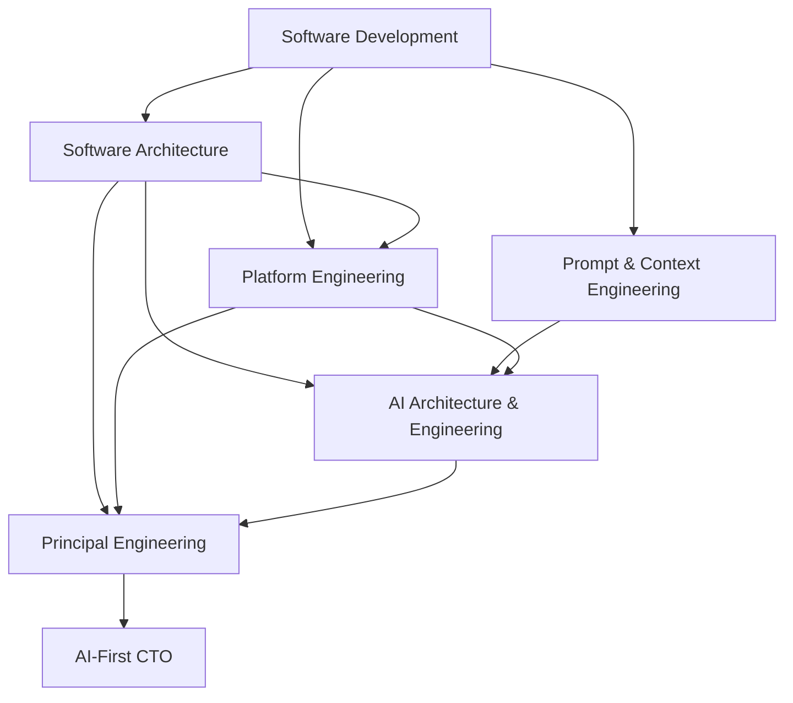

# Principal Engineering & AI-First CTO Roadmap

## Mission

Build a T-shaped engineering profile that can move from code to architecture, platform engineering, AI engineering, and technology leadership while using AI as a force multiplier rather than as a replacement for engineering judgment.

The destination is not simply to know more tools. It is to be able to move through the complete decision chain:

```text
Business Problem
  -> Product / Domain
  -> Software Design
  -> Architecture
  -> Platform / Operations
  -> Security / Reliability
  -> AI Augmentation
  -> Economics / Risk
  -> Technology Strategy
```

## The six tracks

### 1. Software Development

**Goal:** Write software that is correct, understandable, testable, maintainable, and safe to change.

Study:
- Algorithms and data structures
- Object-oriented and functional design fundamentals
- SOLID, KISS, YAGNI, DRY, separation of concerns
- High cohesion and low coupling
- Clean Code — critically, as guidance rather than immutable rules
- Refactoring
- Working with legacy code
- Systematic debugging
- Testing and TDD
- Design patterns and the problems behind them
- Dependency injection
- MVC
- Layered, Clean, and Hexagonal code architecture
- API design
- Code review and engineering standards

**Outcome:** Given an existing codebase, explain its design, identify risks and smells, improve it incrementally, and implement a feature with appropriate tests.

---

### 2. Software Architecture & System Design

**Goal:** Make architecture decisions from requirements and trade-offs rather than trends.

Study:
- Functional vs non-functional requirements
- Quality attributes: availability, reliability, scalability, latency, throughput, consistency, maintainability, security, observability, recoverability and cost
- Architecture Decision Records (ADRs)
- Domain-Driven Design and bounded contexts
- Data modeling
- Distributed systems fundamentals
- Replication, partitioning, transactions and consistency
- CAP and PACELC
- Idempotency, retries, ordering and duplicate delivery
- Eventual consistency
- Caching and messaging
- Saga and Transactional Outbox
- Circuit Breaker, Bulkhead and backpressure
- Architecture styles and their trade-offs:
  - Modular Monolith
  - Microservices
  - Event-Driven Architecture (EDA)
  - Service-Oriented Architecture (SOA)
  - Service-Based Architecture
  - Microkernel / Plugin Architecture
  - Space-Based Architecture
  - Serverless
  - CQRS and Event Sourcing when justified
- Migration and evolutionary architecture
- System design case studies

**Decision rule:** Never begin with "we need Kafka", "we need Kubernetes", or "we need microservices". Begin with the problem, constraints, quality attributes, expected scale, team and economics.

**Outcome:** Produce an architecture proposal with alternatives, trade-offs, diagrams, ADRs, failure analysis, security considerations, rollout strategy and cost implications.

---

### 3. Platform Engineering, DevOps & SRE

**Goal:** Design the path from source code to a reliable production system.

Study:
- Git and trunk/branch strategies
- CI/CD architecture
- Pipeline design patterns
- Reusable pipelines and platform abstractions
- Build and artifact management
- Containers
- Kubernetes — when its operational benefits justify its cost
- Infrastructure as Code
- Terraform
- Cloud architecture, initially AWS
- Environment and configuration management
- Secrets management
- GitOps
- Feature flags
- Canary, blue/green and progressive delivery
- Automated rollback
- Observability: logs, metrics and traces
- OpenTelemetry
- SLI, SLO, SLA and error budgets
- Incident management and postmortems
- Capacity planning
- Resilience engineering
- Disaster recovery, RTO and RPO
- DORA metrics
- Developer Experience and Internal Developer Platforms
- FinOps and cloud cost awareness

**Outcome:** Design a paved road where engineering teams can safely build, test, deploy, observe, recover and operate services with minimal unnecessary cognitive load.

---

### 4. Prompt & Context Engineering

**Goal:** Communicate with AI systems systematically and make their behavior testable and reproducible.

Prompt engineering is treated as a foundation, not as the final AI specialization.

Study:
- Model capabilities and limitations
- System vs user instructions
- Context engineering
- Prompt structure and decomposition
- Few-shot examples
- Structured outputs
- Tool/function calling
- Grounding
- Retrieval context
- Prompt injection and untrusted input
- Context-window management
- Memory strategies
- Prompt versioning
- Evaluation datasets
- LLM-as-judge limitations
- Deterministic checks vs probabilistic evaluation
- Cost, latency and quality trade-offs

**Outcome:** Turn an informal AI request into a versioned, evaluated AI capability instead of relying on a single clever prompt.

---

### 5. AI Architecture & AI Engineering

**Goal:** Understand AI deeply enough to architect, build, evaluate and operate AI-powered systems and autonomous/semi-autonomous agents.

#### Foundations
- Machine learning mental models
- Neural networks
- Transformers
- Tokens, embeddings and vector similarity
- Attention
- LLM inference
- Model families and multimodal models
- Training vs inference
- Fine-tuning and when not to use it

#### AI application architecture
- RAG
- Embeddings and vector databases
- Hybrid search and reranking
- Tool calling
- Structured generation
- Model routing
- Caching
- Guardrails
- Evaluation
- Observability
- Cost and token economics
- AI gateways
- Privacy and data governance

#### Agent engineering
- Agent loop: perceive -> reason -> act -> observe
- Tools and permissions
- Planning and task decomposition
- Memory
- Human-in-the-loop
- Workflow vs autonomous agent
- Single-agent vs multi-agent systems
- MCP and interoperable tool/context interfaces
- Sandboxing
- Approval boundaries
- Agent evaluation
- Failure recovery
- Security against prompt injection and tool abuse

#### AI Software Engineering Agent
Capabilities to develop:
- Understand repositories
- Implement features
- Generate and improve tests
- Debug failures
- Review code
- Refactor safely
- Analyze CI/CD failures
- Produce documentation

The engineer remains accountable for architecture and correctness.

#### AI Architecture Advisor
Capabilities to develop:
- Requirements analysis
- Quality attribute analysis
- Domain modeling
- Architecture alternatives
- Trade-off analysis
- Threat modeling
- Reliability review
- Cost review
- ADR generation
- Challenge overengineering

#### AI Business Operating System
Develop specialized workflows/agents for areas where AI can multiply a small company's capacity:

**Product & research** — market research, competitor analysis, requirements, customer feedback synthesis and experimentation.

**Marketing & growth** — positioning, content planning, copy, SEO research, campaign ideation and analytics interpretation.

**Creative production** — images, diagrams, presentations, product demos, scripts, voice/video workflows and documentation.

**Sales & customer success** — lead research, proposal drafts, CRM assistance, support triage and knowledge retrieval.

**Finance & operations** — budgeting assistance, cash-flow scenarios, KPI analysis, invoice/document workflows, cost analysis and management reporting. Financial/legal/accounting decisions requiring licensed or accountable professionals must remain human-controlled.

**Management** — meeting synthesis, decision tracking, OKRs, risk registers, project coordination and company knowledge retrieval.

**Outcome:** Architect an AI operating layer where agents have explicit responsibilities, tools, permissions, data boundaries, evaluations and human approval points.

---

### 6. Principal Engineer -> CTO

**Goal:** Connect technology decisions to business outcomes.

Study:
- Technical strategy
- Business and product strategy fundamentals
- Engineering economics
- Build vs buy
- Total Cost of Ownership
- Opportunity cost
- Technical debt management
- Portfolio and platform thinking
- Team topology and cognitive load
- Engineering organization design
- Hiring and delegation
- Architecture governance without bureaucracy
- Security and regulatory risk
- Vendor and cloud strategy
- FinOps
- Metrics and outcomes
- Roadmapping
- Technology due diligence
- Communication with executives and customers
- AI adoption strategy and governance

A CTO-level decision should consider:

```text
Business Value
+ Customer Value
+ Time to Market
+ Team Capability
+ Technical Quality
+ Reliability
+ Security
+ Cost
+ Regulatory Risk
+ Future Option Value
```

**Outcome:** Decide not only whether a technology works, but whether the company should invest in it.

---

## Recommended progression



These tracks eventually run in parallel. The progression represents dependency, not a requirement to finish one field before touching the next.

## Learning method

Every concept in this handbook should answer:

1. What problem does it solve?
2. What is the mental model?
3. When should I use it?
4. When should I NOT use it?
5. What alternatives exist?
6. What trade-offs am I accepting?
7. What are its failure modes?
8. What are its security implications?
9. How do I test it?
10. How do I deploy and observe it?
11. What does it cost technically and organizationally?
12. How would I explain the decision in an ADR?
13. What practical exercise proves I understand it?

## Capstone

The roadmap culminates in designing and operating a realistic product as if it were a company platform.

The capstone must include:
- Product requirements
- Domain model
- Architecture decision process
- ADRs
- Application implementation
- Automated testing
- CI/CD
- Infrastructure as Code
- Cloud deployment
- Security model
- Observability and SLOs
- Incident/failure exercises
- Cost model
- AI capabilities
- AI engineering/architecture assistant
- Business AI workflows
- Technical strategy and CTO-level decision log

The final measure of progress is not the number of books, courses or technologies completed. It is the quality of the decisions that can be made, explained, implemented, operated and revised.